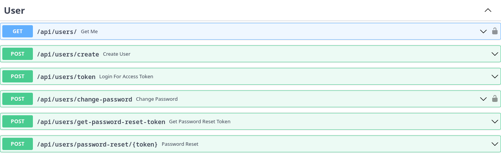
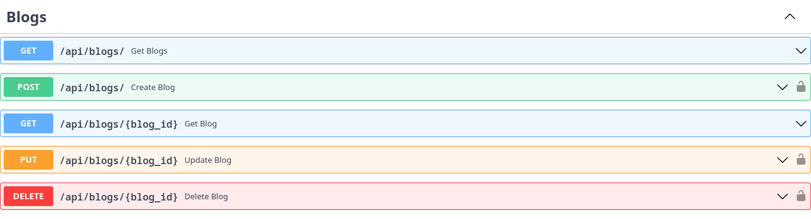
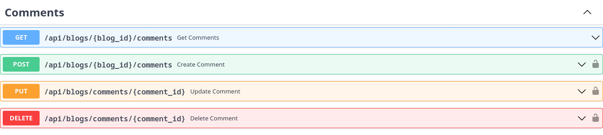

# Miniblog-api
A FastAPI powered API for a blog application

## Tech stack:
1. FastAPI - Serving API
2. Uvicorn - ASGI Server
3. PostgreSQL - Relational Database 
4. ORM - SQLAlchemy
5. Migration - Alembic
## Authentication:
- POST, PUT and DELETE routes require a JWT Token for authentication
## Endpoints: 
- ### Users
  - To authenticate or create a new user
  - /api/users
    

- ### Blogs
  - To Create, Read, Update or Delete blogs
  - /api/blogs
    

- ### Comments
  - To Create, Read, Update or Delete comments
  - /api/comments
    

- ### Likes
  - To Create or Delete like
  - /api/likes
   

## Setup environment variables
1. Rename .env.example to .env
2. Change values
## Install
Using pip:
```bash
pip/3 install -r requirements.txt
```
Using Poetry:
```bash
poetry install
```

## Migrate database
```bash
alembic upgrade head
```
or 
```bash
python3 -m alembic upgrade head
```
## Run
```bash
python3 main.py
```
